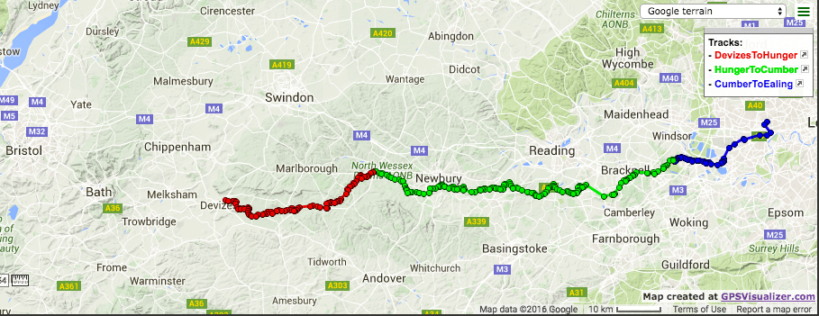

# 2016-05

Cycling from Bath Uni to London, via Cumberland Lodge, Windsor great park for a weekend conference

Bath -> Devizes via the canal tow path (avoids inevitable hills via road)

Devizes -> Hungerford, mainly via Sustrans Route 4 on road section

Hungerford -> Cumberland, mainly via 'Purple' bike route on the Open Cycle Map (OCM), apparently the "around berkshire cycle route". Avoids large hill immediately south of Hungerford on this route, then essentially follows it via Easthampstead all the way to Cumberland lodge.

Cumberland -> Hanwell, via Route 4 to Staines, then up onto the great West Road (let's hope there's a cycle path).
